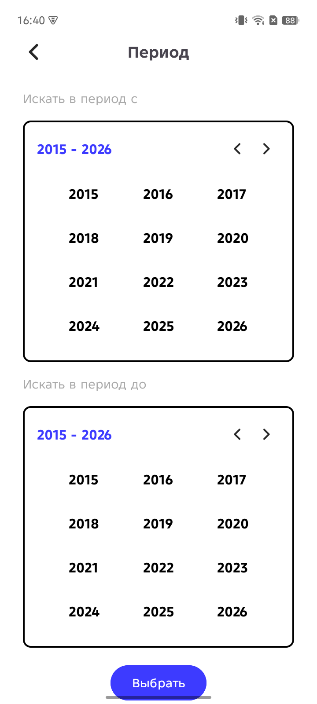

## AfishaMovies 🎬

AfishaMovies — Android‑приложение для просмотра информации о фильмах и сериалах с возможностью поиска, просмотра деталей и управления персональными коллекциями.
Реализовано с использованием современных Android‑технологий и архитектурных подходов для стабильной и масштабируемой работы.

## 📦 Основные особенности

✔ Просмотр списка фильмов
✔ Детальная информация о фильме (постер, рейтинг, описание)
✔ Поиск фильмов по названию
✔ Персональные коллекции (например, «посмотреть позже»)
✔ Оптимизированная база данных с очисткой неиспользуемых данных через WorkManager
✔ Поддержка Deep Link для прямого открытия фильма по URL
✔ Кастомные анимации при навигации между экранами
✔ Дружелюбный UI с адаптацией статусбара под фон постера

## 🧠 Технический стек

Проект разработан с использованием:

## 🟣 Kotlin

## 📱 Android SDK

## 🏗 Clean Architecture

## 📂 MVVM паттерн

## 🧩 Room — локальная база данных

## 🔌 Retrofit — сетевые запросы к Movie API

## 🖼 Glide — загрузка и кэширование изображений

## ♻️ Coroutines — асинхронность

## 🧪 WorkManager — фоновые задачи

## 🔍 DeepLink Support

## 🧠 Dependency Injection (через Dagger 2)

## 🏛 Архитектура

Проект структурирован в соответствии с Clean Architecture, разделён на слои:

presentation
└── ui / fragments / adapters
domain
└── usecases / entities
data
└── dto / database / mappers / repositories

Каждый слой отвечает за свою зону ответственности и не зависит от деталей реализации нижних слоёв.

## 🔧 Особенности реализации
## 🧭 Навигация

BottomNavigationView для основных вкладок

Fragment Stack per tab

Deep link открывает детали фильма с анимацией

## 🎨 Динамический статусбар

Цвет и иконки статусбара адаптируются под доминантный цвет загруженного постера.

## 🗃 Room

Кэширование фильмов и баннеров

DAO для основных таблиц

Periodic cleanup через WorkManager

## 🚀 WorkManager

Фоновая очистка неиспользуемых фильмов/баннеров запускается один раз при старте приложения.

## 📸 Скриншоты и гифки
### 📌 Основные экраны
|           Главный экран            |                 Поиск                  |                 Галерея                  |            Экран списка            |
|:----------------------------------:|:--------------------------------------:|:----------------------------------------:|:----------------------------------:|
|  |  |  |  |

### 📌 Основные экраны
|              Детальный экран фильма               |              Детальный экран профиля              |
|:-------------------------------------------------:|:-------------------------------------------------:|
|  |  |

### 📌 Коллекции
|        Добавление фильма в коллекцию         |                      Создание коллекции                      |
|:--------------------------------------------:|:------------------------------------------------------------:|
|  |  |

### 📌 Настройки и фильтры
|           Экран настройки фильтров           |                   Выбор страны                   |                 Выбор даты                 |
|:--------------------------------------------:|:------------------------------------------------:|:------------------------------------------:|
|  |  |  |

## 📁 Структура проекта
AfishaMovies/
├── app/                       — Основной модуль Android
├── data/                      — Работа с API и базой данных
├── domain/                    — Бизнес‑логика
├── presentation/              — UI слои (фрагменты/вьюмодели)
├── workers/                   — Фоновые задачи
└── README.md                  — Документация

## 📌 Deep Linking

Поддерживается переход на страницу фильма по ссылке формата:

https://afisha.app/film?movieId=<ID>

Открывает детали фильма напрямую.